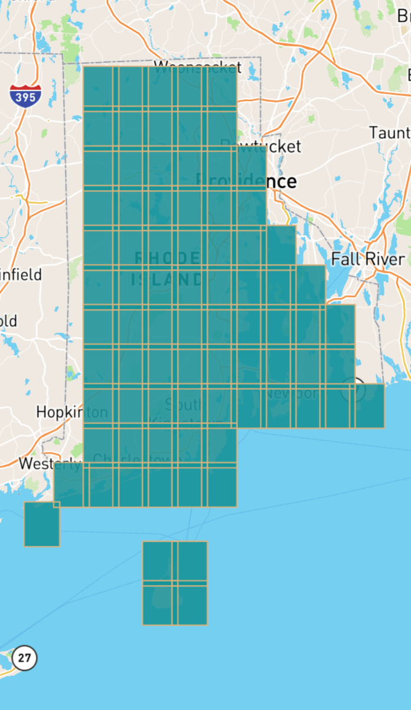

# naip-cogeo-mosaic

Serverless high-resolution NAIP map tiles from Cloud-Optimized GeoTIFFs for the
lower 48 U.S. states.

[Interactive example][example-website]

[][example-website]

60cm-resolution NAIP imagery of the Grand Canyon from 2017.

[example-website]: https://kylebarron.dev/naip-cogeo-mosaic

## Overview

The [National Agriculture Imagery Program (NAIP)][naip-info] acquires aerial
imagery during the agricultural growing seasons in the continental U.S. All NAIP
imagery between 2011 and 2018 is stored in an AWS S3 [public dataset][naip-aws],
and crucially the `naip-visualization` bucket stores images in [Cloud-Optimized
GeoTIFF (COG) format][cog-format]. Because this data format supports streaming
portions of the image at a time, it [enables serving a basemap of
imagery][dynamic-map-tiling-blog] on demand without needing to preprocess and
store any imagery.

This repository is designed to create [MosaicJSON][mosaicjson] files
representing collections of NAIP imagery that can be used with
[`cogeo-mosaic-tiler`][cogeo-mosaic-tiler] to serve map tiles on demand.

[naip-info]: https://www.fsa.usda.gov/programs-and-services/aerial-photography/imagery-programs/naip-imagery/
[naip-aws]: https://registry.opendata.aws/naip/
[cog-format]: https://www.cogeo.org/
[dynamic-map-tiling-blog]: https://kylebarron.dev/blog/cog-mosaic/overview
[cogeo-mosaic-tiler]: https://github.com/developmentseed/cogeo-mosaic-tiler
[mosaicjson]: https://github.com/developmentseed/mosaicjson-spec

## Using

If you'd like to get running quickly, you can use a built mosaicJSON
file in the [`filled/` folder][filled/] and skip down to ["Deploy"](#deploy).

Otherwise, the following describes how to create a custom mosaicJSON file from
specified years of NAIP imagery available on AWS.

[filled/]: https://github.com/kylebarron/naip-cogeo-mosaic/tree/master/filled

### Install

Clone the repository and install Python dependencies.

```
git clone https://github.com/kylebarron/naip-cogeo-mosaic
cd naip-cogeo-mosaic
conda env create -f environment.yml
source activate naip-cogeo-mosaic
```

If you prefer using pip, you can run

```
pip install awscli click pygeos 'rio-cogeo>=2.0a4' 'cogeo-mosaic>=3.0a5'
```

### Select TIF URLs

This section outlines methods for selecting files that represent a country-wide
mosaic of NAIP imagery, which can then be put into a MosaicJSON file for
serving.

Download `manifest.txt`. This file has a listing of all files stored on the
`naip-visualization` bucket.

```bash
aws s3 cp s3://naip-visualization/manifest.txt ./manifest.txt --request-payer
```

In the NAIP program, different states are photographed in different years, with
a target of imaging all states within every 3 years. [Here's an interactive
map][naip-years] of when each state was photographed, (though it doesn't appear
to include 2018 yet; [this graphic][naip_coverage_2018] shows which states were
photographed in 2018).

[naip-years]: https://www.arcgis.com/home/webmap/viewer.html?webmap=17944d45bbef42afb05a5652d7c28aa5
[naip_coverage_2018]: https://www.fsa.usda.gov/Assets/USDA-FSA-Public/usdafiles/APFO/status-maps/pdfs/NAIP_Coverage_2018.pdf

All (lower 48) states were photographed between 2011-2013, and again in
2014-2015. All states except Maine were photographed in 2016-2017. All states
except Oregon were photographed in 2017-2018.

Therefore, I'll generate four MosaicJSONs, with each spanning a range of
2011-2013, 2014-2015, 2015-2017, and 2016-2018. For the last two, I include an
extra start year just for Maine/Oregon, but set each to use the latest available
imagery, so only Maine takes imagery from 2015 and only Oregon takes imagery
from 2016, respectively.

The following code block selects imagery for each time span. You can run `python code/naip.py --help` for a full description of available options.

```bash
python code/naip.py manifest \
    -s 2011 \
    -e 2013 \
    --select-method last \
    manifest.txt \
    | sed -e 's|^|s3://naip-visualization/|' \
    > urls_2011_2013.txt
python code/naip.py manifest \
    -s 2014 \
    -e 2015 \
    --select-method last \
    manifest.txt \
    | sed -e 's|^|s3://naip-visualization/|' \
    > urls_2014_2015.txt
python code/naip.py manifest \
    -s 2015 \
    -e 2017 \
    --select-method last \
    manifest.txt \
    | sed -e 's|^|s3://naip-visualization/|' \
    > urls_2015_2017.txt
python code/naip.py manifest \
    -s 2016 \
    -e 2018 \
    --select-method last \
    manifest.txt \
    | sed -e 's|^|s3://naip-visualization/|' \
    > urls_2016_2018.txt
```

Each output file includes one filename for each quad identifier, deduplicated
across years.

```
> head -n 5 urls_2016_2018.txt
s3://naip-visualization/al/2017/100cm/rgb/30085/m_3008501_ne_16_1_20171018.tif
s3://naip-visualization/al/2017/100cm/rgb/30085/m_3008501_nw_16_1_20171006.tif
s3://naip-visualization/al/2017/100cm/rgb/30085/m_3008502_ne_16_1_20170909.tif
s3://naip-visualization/al/2017/100cm/rgb/30085/m_3008502_nw_16_1_20170909.tif
s3://naip-visualization/al/2017/100cm/rgb/30085/m_3008503_ne_16_1_20171017.tif
```

Additionally, files along state borders are deduplicated. Often,
cells on state borders are duplicated across years. For example, this image is
duplicated in both Texas's and Louisiana's datasets:

```
tx/2012/100cm/rgb/29093/m_2909302_ne_15_1_20120522.tif
la/2013/100cm/rgb/29093/m_2909302_ne_15_1_20130702.tif
```

As you can tell by the cell and name, these are the same position across
different years. I deduplicate these to reduce load on the lambda function
parsing the mosaicJSON.

To visualize the quads covered by a list of urls, you can visualize its
footprint. For example, to get the mosaic footprint of Rhode Island from the
2011-2013 mosaic:

```bash
export AWS_REQUEST_PAYER="requester"
cat urls_2011_2013.txt \
    | grep "^s3://naip-visualization/ri/" \
    | cogeo-mosaic footprint - > footprint.geojson
```

And inspect it with [kepler.gl](https://github.com/kylebarron/keplergl_cli):

```bash
kepler footprint.geojson
```



Here you can see that the tiles to be used in the mosaic of Rhode Island don't
include the state's border. That's because the Python script to parse the
manifest deduplicates tiles on the border when they're include in both states.
If you looked at the footprint of Connecticut, you'd see the missing tiles on
the border.

Total number of files

```bash
> wc -l urls_2011_2013.txt
  213197 urls_2011_2013.txt
```

### Create MosaicJSON

NAIP imagery tiffs are in a requester pays bucket. In order to access them, you
need to set the `AWS_REQUEST_PAYER` environment variable:

```bash
export AWS_REQUEST_PAYER="requester"
```

I also found that on an AWS EC2 instance; `cogeo-mosaic create` was failing
while it was working on my local computer. In general, if `cogeo-mosaic create`
isn't working for some URL; you should run `rio info <URL>` and see what the
error is, since `cogeo-mosaic` uses `rasterio` internally, but doesn't currently
print `rasterio` errors to stdout. In my case, I had to set the certificates
path (see
[cogeotiff/rio-tiler#19](https://github.com/cogeotiff/rio-tiler/issues/19),
[mapbox/rasterio#942](https://github.com/mapbox/rasterio/issues/942)).

```bash
export CURL_CA_BUNDLE=/etc/ssl/certs/ca-certificates.crt
```

I don't know how much data `cogeo-mosaic create` downloads (it only requests the
GeoTIFF headers of each file), but it might be wise to run the mosaic creation
on an AWS EC2 instance in the `us-west-2` region (the same region where the NAIP
imagery is located), so that you don't have to pay for egress bandwidth on the
requests. I found that creating the mosaic took about 1.5GB of memory; it
finished in about 7 hours per mosaic on a `t2.small` instance.

Then create the MosaicJSON file. GET requests are priced at `$0.0004` per 1000
requests, so creating the MosaicJSON should cost `0.0004 * (200000 / 1000) = 0.08`. 8 cents!

```bash
cat urls_2011_2013.txt \
    | cogeo-mosaic create - \
    > naip_2011_2013_mosaic.json
cat urls_2014_2015.txt \
    | cogeo-mosaic create - \
    > naip_2014_2015_mosaic.json
cat urls_2015_2017.txt \
    | cogeo-mosaic create - \
    > naip_2015_2017_mosaic.json
cat urls_2016_2018.txt \
    | cogeo-mosaic create - \
    > naip_2016_2018_mosaic.json
```

#### Fill in missing quadkeys

Some of these years have small missing areas. For example, in some years parts
of Montana weren't photographed. `fill_mosaic_holes.py` is a simple script to fill mosaic quadkeys across years.

This following tells the script to look at all the mosaics `data/*.json` and
create new filled scripts output to the `filled/` folder.

```py
python code/fill_mosaic_holes.py -o filled data/naip_201*.json
```

Note that this fills in entire quadkeys that are missing in one year but that
exist in another. _However_, if a year is missing some areas, there will be
quadkeys that _exist_ but only have _partial_ data. So without more effort there
can still be some small holes in the data. See [issue #8][issue-8].

[issue-8]: https://github.com/kylebarron/naip-cogeo-mosaic/issues/8

## Deploy

```bash
# Create lambda package
git clone https://github.com/developmentseed/cogeo-mosaic-tiler
cd cogeo-mosaic-tiler
make package
cd ..

# Deploy
npm install serverless -g
sls deploy --bucket your-mosaic-bucket
```

### Upload MosaicJSON files

In order for `cogeo-mosaic-tiler` to create your tiles on demand, it needs to
access a MosaicJSON file, which you need to host somewhere accessible by
`cogeo-mosaic-tiler`.

Generally the simplest method is uploading the JSON file to S3. However since
these files are so large (~64MB uncompressed), I found that it was taking 2.5s
to load and parse the JSON.

As of v3, `cogeo-mosaic` (and thus also `cogeo-mosaic-tiler`) support alternate
_backends_, such as DynamoDB. DynamoDB is a serverless database that makes
loading the MosaicJSON fast, because the tiler only needs one or two reads,
which each take around 10ms (as long as the DynamoDB table is in the same region
as the tiler).

For full backend docs, see [`cogeo-mosaic`][cogeo-mosaic].

[cogeo-mosaic]: https://github.com/developmentseed/cogeo-mosaic

#### DynamoDB

If you wish to connect the tiler to one or more DynamoDB tables, you need to deploy with

```bash
sls deploy --bucket your-mosaic-bucket --aws-account-id your-aws-account-id
```

You can find your AWS account ID with

```bash
aws sts get-caller-identity
```

To upload a MosaicJSON to DynamoDB, run:

```bash
pip install -U cogeo-mosaic>=3.0a5
cogeo-mosaic upload --url 'dynamodb://{aws_region}/{table_name}' mosaic.json
```

That uploads the MosaicJSON to the given table in the specified region, creating
the table if necessary.

### Proxy your endpoint with Cloudflare

I like to proxy through Cloudflare to take advantage of their free caching. You can read my blog post [here][cloudflare_caching] to see how to do that.

[cloudflare_caching]: https://kylebarron.dev/blog/caching-lambda-functions-cloudflare
